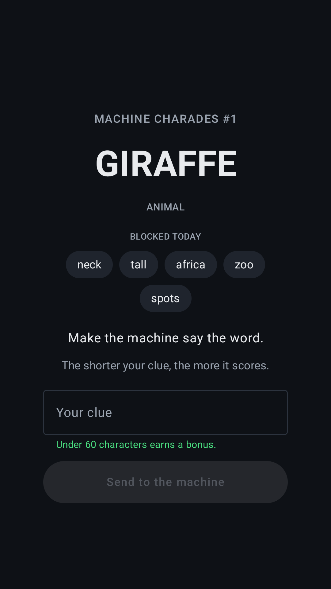
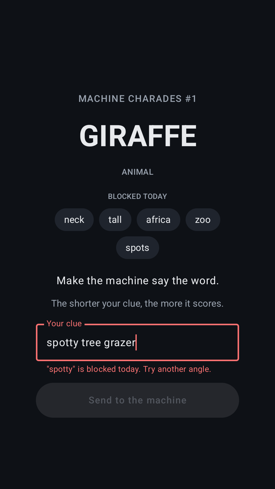
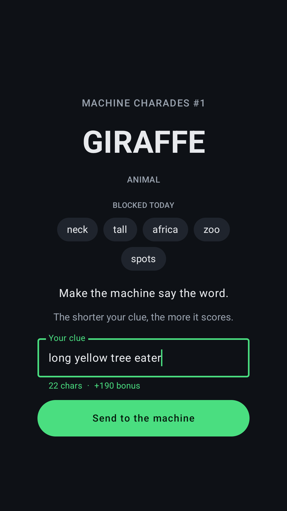
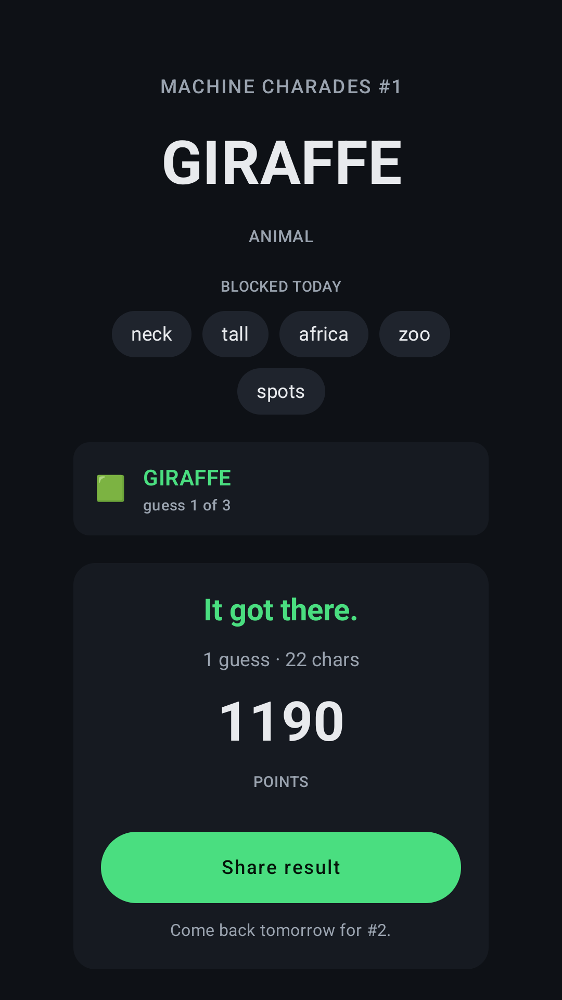

# Machine Charades

**A daily word game where you write the clue and a language model has to guess the word.**

Most word games ask you to find the answer. This one shows you the answer and makes you
explain it to a machine.

Android and iOS, from one Kotlin Multiplatform codebase.

---

## The game

You get a word. Say **GIRAFFE**. You write a clue, and the model gets three guesses.

Five obvious words are blocked that day — *neck, tall, africa, zoo, spots* — and it catches
variations too, so `necked` and `spotty` don't slip past. You have to go around.

The twist that emerged while building it: **the model is good.** It gets almost any fair clue
on the first try. So the game isn't "can you make it guess" — it's *how few characters can you
do it in.* `long yellow tree eater` works and scores 1190. Under twenty characters is hard.

Every puzzle shows **par** — the median clue length among everyone who has solved it — so a
score means something. Beating par is the game.

| | | | |
|---|---|---|---|
|  |  |  |  |

---

## Why this is a Kotlin Multiplatform project

Not "Kotlin for the logic, native for the UI". **The entire app is shared Kotlin**, including
every screen, and the platform layer is five files.

```
shared/src/commonMain     2,323 lines    game, UI, networking, billing, persistence
shared/src/androidMain      103 lines    5 actuals
shared/src/iosMain           57 lines    5 actuals
iosApp/*.swift               28 lines    the entry point, and nothing else
```

Around 94% of the codebase is written once. There is no SwiftUI in this project beyond the
28-line host that presents the Compose view.

### The five things that genuinely differ

| `expect` | Android | iOS |
|---|---|---|
| `rememberShareAction()` | `Intent.ACTION_SEND` | `UIActivityViewController` |
| `platformStorage()` | `SharedPreferences` | `NSUserDefaults` |
| `platformHttpClient()` | Ktor OkHttp engine | Ktor Darwin engine |
| `storeApiKey` | RevenueCat Google key | RevenueCat Apple key |
| `getPlatform()` | name + version | name + version |

That's the whole list. Subscriptions are shared too — [`purchases-kmp`](https://github.com/RevenueCat/purchases-kmp)
means entitlements, offerings and the purchase flow live in `commonMain` rather than being
written twice against `BillingClient` and `StoreKit`.

Two decisions that kept the platform layer this thin:

- **Firebase is called over REST, not through its SDK.** Anonymous auth is one HTTP request.
  Pulling in the Android SDK would have forced an `expect`/`actual` around the whole auth
  surface, and dragged an ad ID and analytics into the binary that this app has no use for.
- **The UI never branches on platform.** Compose Multiplatform renders the same tree on both,
  and the design commits to one fixed dark palette rather than deferring to Material You on
  one side and iOS conventions on the other.

---

## Architecture

```
Compose Multiplatform UI  ──►  ClueValidator (Kotlin)      instant, local, offline
         │                     rejects before any request
         ▼
  Cloudflare Worker  ──►  validator.ts                     the authority
         │                revalidates every clue
         ├──►  KV: puzzles      pre-generated schedule, one document per day
         ├──►  KV: cache        guesses by clue hash, par histograms, rate limits
         └──►  Gemini           only on a cache miss
```

**Puzzles are generated offline** and uploaded to KV, so a normal session costs nothing: every
player on a given day reads the same pre-made document, and the only live model call is the
guess. Guesses are cached by a hash of the normalised clue — players converge hard on the same
phrasings, so this runs at a high hit rate within days, and a hit returns in ~20ms instead of
~700ms.

**The clue text is never stored.** It is SHA-256'd into a cache key, sent to the model in
flight, and dropped. Only the hash and the model's answer survive, for 14 days.

**Nothing lets a player read ahead.** The puzzle number is resolved from a date index
server-side and never taken from the request. The archive endpoint serves only puzzles whose
scheduled date has already passed — today included, since today is played through
`/puzzle/today` where one-round-a-day is enforced. There is a dev override to force a puzzle
number, gated behind a flag no deployed Worker sets — and the test for it asserts that five
different smuggling shapes (`?n=8`, `?number=8`, `?n=8&n=7`, `?N=8`, `?n=%38`) all still
resolve to today with the flag unset.

---

## The interesting problem: banned words that aren't there

Blocking a word is easy. Blocking it *without* blocking innocent words that contain it is not.

Detection runs on a collapsed "skeleton" form of the clue, which catches `n-e-c-k`, `NECK`,
`ne ck` and `necked` alike. But substring matching cannot tell a compound boundary from a
coincidence without a dictionary, so `light` rejects **delight**, `sting` rejects **casting**,
`sand` rejects **sandwich**, and `wind` rejects **window**.

A player experiences a false rejection as a bug in the game, not as a rule. So the false
positive rate is measured rather than assumed — [`tools/probe-validator.mjs`](tools/probe-validator.mjs)
runs the real validator against the real puzzle set and prints every rejection to be judged by
hand. Each of the four cases above was caught by that probe and is documented at the fix.

The rules are implemented twice on purpose: **Kotlin in `commonMain`** so the client can refuse
a clue as you type it, offline, with no round trip; and **TypeScript in the Worker** as the
authority, because a client-side check is a convenience and never a control. The two are kept
in step by their test suites, not by shared code.

---

## Running it

You'll need `local.properties` at the repo root:

```properties
sdk.dir=/path/to/Android/sdk
worker.url=https://your-worker.workers.dev
firebase.webApiKey=AIza...
revenuecat.androidKey=goog_...      # test_... is refused by release builds
revenuecat.iosKey=appl_...
```

```bash
./gradlew :androidApp:assembleDebug          # Android
open iosApp/iosApp.xcodeproj                 # iOS

cd worker && npm install && npx wrangler dev  # the API
```

Generating a puzzle schedule and uploading it:

```bash
cd tools && node generate-puzzles.mjs --start 2026-09-03 --days 60
cd ../worker && npx wrangler kv bulk put --binding PUZZLES ../tools/out/kv-puzzles.json --remote
```

## Tests

```bash
./gradlew :shared:allTests    # 100 tests, run on both JVM and iOS
cd worker && npm test         # 79 tests
```

The shared suite runs on Kotlin/Native as well as the JVM, so the iOS build is covered by the
same assertions rather than assumed to behave.

---

## Licence

**Source available, not open source.** The code is published so it can be read and
discussed; it is not licensed for reuse. Copyright is retained in full — see
[LICENSE](LICENSE).

---

Built for [Shipaton 2026](https://shipaton.revenuecat.com). Subscriptions by RevenueCat, API on
Cloudflare Workers, guesses by Gemini.
