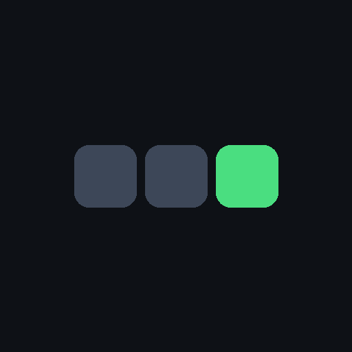
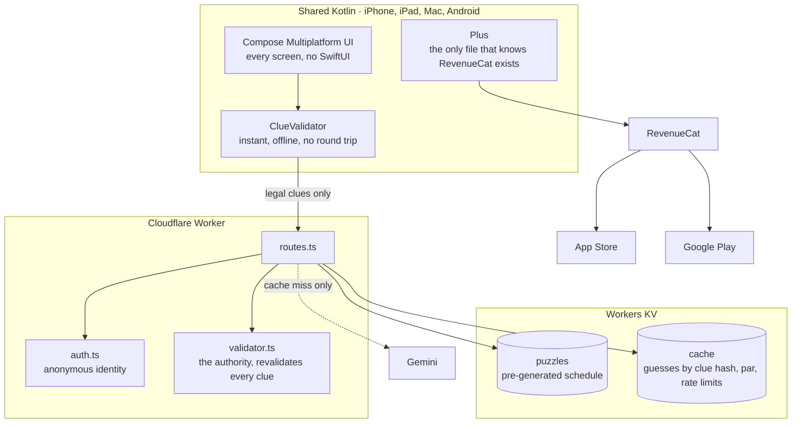
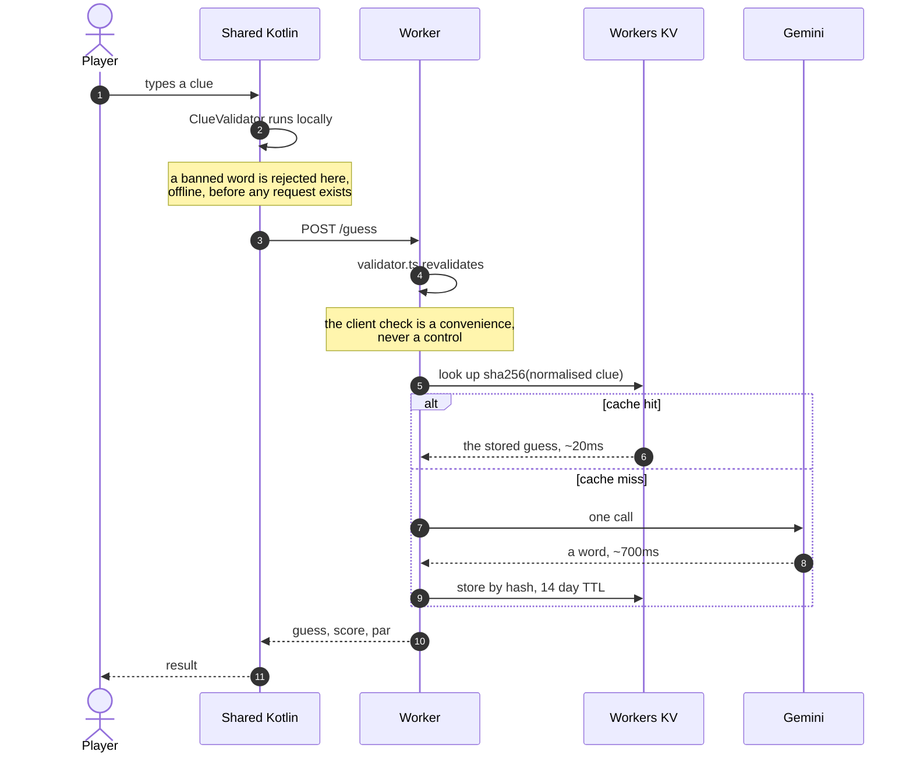

<div align="center">



# Machine Charades

**A daily word game where you write the clue and a language model has to guess the word.**

Most word games ask you to find the answer. This one shows you the answer and makes you
explain it to a machine.

**[Watch the demo (1:44)](https://youtube.com/shorts/CRBlALFE3kw)**
&nbsp;·&nbsp; **[App Store](https://apps.apple.com/app/machine-charades/id6809356797)**
&nbsp;·&nbsp; **[Google Play](https://play.google.com/store/apps/details?id=com.techtush.machinecharades)**
&nbsp;·&nbsp; **[Website](https://tushartechs.github.io/machine-charades/)**

iPhone, iPad, Mac and Android, from one Kotlin Multiplatform codebase.
Built for [RevenueCat Shipaton 2026](https://revenuecat-shipaton-2026.devpost.com).

</div>

---

## At a glance

| | |
|---|---|
| **Shared code** | 85% (2,970 lines common, 519 lines platform-specific) |
| **Platform layer** | 8 `expect`/`actual` declarations, listed in full [below](#the-eight-things-that-genuinely-differ) |
| **Monetisation** | RevenueCat via [`purchases-kmp`](https://github.com/RevenueCat/purchases-kmp), in `commonMain` |
| **Backend** | Cloudflare Worker + Workers KV, 1,026 lines of TypeScript |
| **Tests** | 55 shared Kotlin tests on two targets, 81 Worker tests |
| **Model** | Gemini, called server side only, on a cache miss |

**Where to look first, if you are reviewing this:**

- [Architecture](#architecture), with the request path and the caching that makes it cheap
- [The interesting problem](#the-interesting-problem-banned-words-that-arent-there): blocking a word without blocking innocent words containing it
- [How the money works](#how-the-money-works): why the daily puzzle is permanently free and what the entitlement check does when no store is configured
- [What was measured](#what-was-measured): the self-play result that proved the original difficulty design wrong
- [How this was built](#how-this-was-built), including what was written by an AI and what was not

---

## The game

You get a word. Say **GIRAFFE**. You write a clue, and the model gets three guesses.

Five obvious words are blocked that day (*neck, tall, africa, zoo, spots*), and it catches
variations too, so `necked` and `spotty` don't slip past. You have to go around.

The twist that emerged while building it: **the model is good.** It gets almost any fair clue
on the first try. So the game isn't "can you make it guess". It is *how few characters can you
do it in.* `fort vs tide` solves SANDCASTLE on the first guess in twelve characters and
scores 1,270.

Every puzzle shows **par**, the median clue length among everyone who has solved it, so a
score means something. Beating par is the game.

| | | | |
|---|---|---|---|
|  |  |  |  |

---

## What was measured

The original design was a game about whether you could make the machine guess at all. That
turned out to be the wrong game, and a measurement is what said so.

[`tools/measure-difficulty.mjs`](tools/measure-difficulty.mjs) plays the game against itself
using the real model and the real validator, across a sweep of character budgets:

| Clue budget | Model wins on the first guess |
|---|---|
| 60 characters | 100% |
| 40 characters | 100% |
| 25 characters | 90% |
| 15 characters | 67% |

Before running it, I had hardened the banned word lists adversarially, by asking the model
which words it leans on for each answer and blocking those too. **That moved the win rate by
nothing at all.** Length moved everything.

So `CHAR_ALLOWANCE` went from 60 to 30, the per-character bonus went from 5 to 15, and par
ships with each puzzle as a live target while you type rather than as a number revealed
afterwards. The three-guess structure survives as framing, but it is honestly decorative: the
model rarely needs the second guess.

```bash
cd tools && node measure-difficulty.mjs --budgets 60,40,25,15
```

---

## Architecture



A single round, and why it usually costs nothing:



**Puzzles are generated offline** and uploaded to KV, so a normal session costs nothing: every
player on a given day reads the same pre-made document, and the only live model call is the
guess. Players converge hard on the same phrasings, so the cache runs at a high hit rate
within days.

**The clue text is never stored.** It is SHA-256'd into a cache key, sent to the model in
flight, and dropped. Only the hash and the model's answer survive, for 14 days.

**Nothing lets a player read ahead.** The puzzle number is resolved from a date index
server-side and never taken from the request. The archive endpoint serves only puzzles whose
scheduled date has already passed, today included, since today is played through
`/puzzle/today` where one-round-a-day is enforced. There is a dev override to force a puzzle
number, gated behind a flag no deployed Worker sets, and the test for it asserts that five
different smuggling shapes (`?n=8`, `?number=8`, `?n=8&n=7`, `?N=8`, `?n=%38`) all still
resolve to today with the flag unset.

---

## Why this is a Kotlin Multiplatform project

Not "Kotlin for the logic, native for the UI". **The entire app is shared Kotlin**, including
every screen.

```
shared/src/commonMain     2,970 lines    game, UI, networking, billing, persistence
shared/src/androidMain      297 lines    actuals
shared/src/iosMain          165 lines    actuals
androidApp + iosApp          57 lines    two thin hosts, and nothing else
```

**85% of the codebase is written once.** There is no SwiftUI in this project beyond the
28-line host that presents the Compose view. The iOS build also runs on Apple Silicon Macs
from the Mac App Store, verified, where the reading-width cap keeps the layout correct in a
resizable window.

### The eight things that genuinely differ

| `expect` | Android | iOS |
|---|---|---|
| `rememberShareAction()` | `Intent.ACTION_SEND` | `UIActivityViewController` |
| `platformStorage()` | `SharedPreferences` | `NSUserDefaults` |
| `platformHttpClient()` | Ktor OkHttp engine | Ktor Darwin engine |
| `storeApiKey` | RevenueCat Google key | RevenueCat Apple key |
| `getPlatform()` | name + version | name + version |
| `DailyReminderEffect()` | `AlarmManager` + a receiver | `UNUserNotificationCenter` |
| `SoundPlayer` | `SoundPool` | `AVAudioPlayer` |
| `createSoundPlayer()` | constructs it | constructs it |

That's the whole list. Subscriptions are shared too: [`purchases-kmp`](https://github.com/RevenueCat/purchases-kmp)
means entitlements, offerings and the purchase flow live in `commonMain` rather than being
written twice against `BillingClient` and `StoreKit`.

Three decisions that kept the platform layer this thin:

- **Firebase is called over REST, not through its SDK.** Anonymous auth is one HTTP request.
  Pulling in the Android SDK would have forced an `expect`/`actual` around the whole auth
  surface, and dragged an ad ID and analytics into the binary that this app has no use for.
- **The daily reminder uses platform APIs, not a push SDK.** `AlarmManager` plus a receiver on
  Android and `UNUserNotificationCenter` on iOS, with no androidx dependency at all. The phone
  already knows a new puzzle appears daily, so a backend and a push certificate would be
  machinery in service of a message the clock can deliver. This forfeited an entire Shipaton
  prize category, and it was still the right call.
- **The UI never branches on platform.** Compose Multiplatform renders the same tree on both,
  and the design commits to one fixed dark palette rather than deferring to Material You on
  one side and iOS conventions on the other.

---

## How the money works

**Today's puzzle is free, permanently, and not as a trial.** A daily game that gates the daily
thing does not survive a week, because the habit is the product. The free tier is a complete
game: the word, the blocked list, three guesses, the score, the streak.

**Plus sells difficulty, not access.** Three constraint modes (no vowels, one word, twenty
characters), the full archive of past puzzles, and the complete record: solve rate, shortest
clue, clue-length average. Each is worthless to someone who has played once and valuable to
someone on a thirty day streak.

Pricing is set from purchasing power rather than converted at the spot rate: 9.99 USD a year
and 2.99 USD a month, 299 INR a year and 49 INR a month. The annual plan leads the paywall and
carries a one week trial, because an annual term matches a daily habit.

The whole integration lives behind one object, [`Plus.kt`](shared/src/commonMain/kotlin/com/machinecharades/data/Plus.kt),
and no other file in the app imports a RevenueCat type. The entitlement check is the part
worth reading:

```kotlin
/** False in a build with no key, so the paywall stays hidden rather than broken. */
val isConfigured: Boolean get() = storeApiKey.isNotEmpty()

fun unlocked(entitled: Boolean, configured: Boolean = isConfigured): Boolean =
    entitled || !configured
```

It takes both the entitlement **and** whether a store is configured at all. With no key, every
gate in the app opens and the app degrades to a complete free game with no dead paywall
anywhere, rather than a wall of padlocks that open an empty sheet. That is not hypothetical:
bank verification held up Google Play billing, and this is what let the Android build ship
anyway without a reviewer finding a door they could not open.

---

## The interesting problem: banned words that aren't there

Blocking a word is easy. Blocking it *without* blocking innocent words that contain it is not.

Detection runs on a collapsed "skeleton" form of the clue, which catches `n-e-c-k`, `NECK`,
`ne ck` and `necked` alike. But substring matching cannot tell a compound boundary from a
coincidence without a dictionary, so `light` rejects **delight**, `sting` rejects **casting**,
`sand` rejects **sandwich**, and `wind` rejects **window**.

A player experiences a false rejection as a bug in the game, not as a rule. So the false
positive rate is measured rather than assumed: [`tools/probe-validator.mjs`](tools/probe-validator.mjs)
runs the real validator against the real puzzle set and prints every rejection to be judged by
hand. Each of the four cases above was caught by that probe and is documented at the fix.

The rules are implemented twice on purpose: **Kotlin in `commonMain`** so the client can refuse
a clue as you type it, offline, with no round trip; and **TypeScript in the Worker** as the
authority, because a client-side check is a convenience and never a control. The two are kept
in step by their test suites, not by shared code.

---

## How this was built

This project was built with **Claude** (Anthropic's Claude Code) as the primary implementer,
working from my direction. Stating that plainly seems better than leaving it to be inferred.

**What Claude wrote:** most of the code in this repository. The Compose Multiplatform UI and
every screen in it, the shared game core and scoring, the clue validator in both Kotlin and
TypeScript, the Cloudflare Worker and its test suite, the RevenueCat integration and the
`Plus` abstraction, the eight `expect`/`actual` pairs, and the measurement and probe tooling
in `tools/`.

**What I did:** the concept and the game design, and every decision about what should exist.
Which ideas were worth building and which were cut. The product calls: that the daily puzzle
stays free forever, that Plus sells difficulty rather than access, and what each plan costs in
each market. All of the release work, which was most of the actual difficulty: Apple
enrollment, certificates and provisioning, App Store Connect, two rejections and the responses
to them, fourteen days of Play closed testing, the production access application, and the
store listings. Device testing on iPhone, Mac and a Pixel. Collecting and acting on tester
feedback. And the judgement calls when something broke, including choosing to ship Android as
a complete free game rather than show padlocks over purchases that could not complete.

The division that mattered most: Claude was faster at writing a validator than I was, but the
decision to *measure* the difficulty curve rather than argue about it, and then to throw away
a week of banned-word work because the numbers said it did nothing, was the decision that made
this a good game. Tools do not make that call.

---

## Running it

You'll need `local.properties` at the repo root:

```properties
sdk.dir=/path/to/Android/sdk
worker.url=https://your-worker.workers.dev
firebase.webApiKey=AIza...
revenuecat.androidKey=goog_...      # test_... is refused by release builds
revenuecat.iosKey=appl_...
```

```bash
./gradlew :androidApp:assembleDebug           # Android
open iosApp/iosApp.xcodeproj                  # iOS and Mac

cd worker && npm install && npx wrangler dev  # the API
```

Generating a puzzle schedule and uploading it:

```bash
cd tools && node generate-puzzles.mjs --start 2026-09-03 --days 60
cd ../worker && npx wrangler kv bulk put --binding PUZZLES ../tools/out/kv-puzzles.json --remote
```

Full setup, including signing, store configuration and the RevenueCat dashboard, is in
[SETUP.md](SETUP.md).

## Tests

```bash
./gradlew :shared:allTests    # 55 tests, run on both the JVM and Kotlin/Native
cd worker && npm test         # 81 tests
```

The shared suite runs on Kotlin/Native as well as the JVM, so the iOS build is covered by the
same assertions rather than assumed to behave.

---

## Also in this repository

| | |
|---|---|
| [SETUP.md](SETUP.md) | Full build, signing and store setup, end to end |
| [docs/DECISIONS.md](docs/DECISIONS.md) | The calls that shaped the app, and what each one cost |
| [tools/measure-difficulty.mjs](tools/measure-difficulty.mjs) | Self-play difficulty measurement |
| [tools/probe-validator.mjs](tools/probe-validator.mjs) | False-positive probe for the banned-word rules |
| [store/](store/) | Store assets, the demo edit list, and the submission copy |

---

## Licence

**Source available, not open source.** The code is published so it can be read and
discussed; it is not licensed for reuse. Copyright is retained in full. See
[LICENSE](LICENSE).

---

Built for [Shipaton 2026](https://revenuecat-shipaton-2026.devpost.com). Subscriptions by RevenueCat, API on
Cloudflare Workers, guesses by Gemini.
